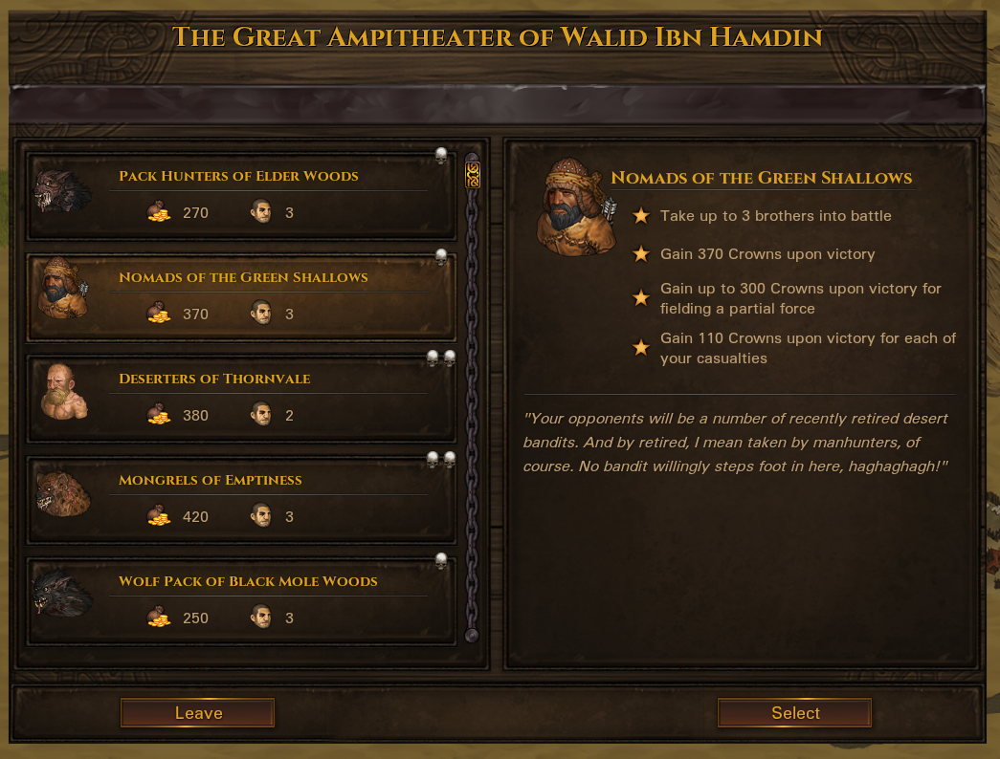

# Blazing Deserts+

A mod for the game Battle Brothers ([Steam](https://store.steampowered.com/app/365360/Battle_Brothers/), [GOG](https://www.gog.com/game/battle_brothers), [Developer Site](http://battlebrothersgame.com/buy-battle-brothers/)).

## Table of contents

-   [Features](#features)
-   [Requirements](#requirements)
-   [Installation](#installation)
-   [Uninstallation](#uninstallation)
-   [Compatibility](#compatibility)
-   [Credits](#credits)

## Features

**Blazing Deserts+ is currently in a BETA state. Content is still being balanced and rebalanced, much more content is still planned, and both mechanics and implementation are subject to change.**

Blazing Deserts+ is a content expansion to the Blazing Deserts DLC. It adds:
- A total overhaul of the arena system, allowing you to choose from a selection of fights every day with varying challenges, rewards, and twists
    - For modders who want to use or interact with this system in their own mods, I've written a brief primer on the implementation [here](./arena_implementation.md).
- 5 new Southern Backgrounds
- NPC Crownling bands roaming the world
- A handful of new unit types
- New events
- And more to come!

### **The Arena**

    

The arena offers challengers a variety of fights to test their mettle against, with new ones added on a regular basis. The challenge and number of contestants allowed vary on a fight-to-fight basis, as do the potential rewards. The arena trades coin for boldness and bloodsport, and so it is that daring odds and death will see you receive more pay if you win. Not all fights are as straightforward as they appear; much can happen on the way to the arena, and some matches will have twists to make them easier, harder, or simply different.

A new campaign is required to use the new arena system.

### **Backgrounds**

New backgrounds are available for hire: nomadic Blade Dancers who have found their way into the bazaars and markets of the Southern City-States, imposing Indemnifier slave-knights discharged from their barracks for one reason or another, and more.

In addition, some existing backgrounds have been adjusted:
- Manhunters can no longer be Superstitious, in line with other Southern backgrounds
- Southern Assassins can appear at levels 2 & 3, and occasionally with full Face Masks
- Ranged Nomads can occasionally spawn with Desert Stalker Head Wrap
- Gladiators start Arena matches at Confident morale

### **Crownlings**

NPC bands of Southern Crownlings can now spawn on the map and work for various factions, just the same as their Northern counterparts. Crownlings use an array of (predominantly Southern) equipment in battle offer a very similar challenge to mercenaries.

## Requirements

1) [Modding Script Hooks](https://www.nexusmods.com/battlebrothers/mods/42) (v20 or later)
2) [Blazing Deserts](http://battlebrothersgame.com/blazing-deserts-release/)

## Installation

1) Download the mod from the [releases page](https://github.com/jcsato/blazing_deserts_plus/releases/latest)
2) Without extracting, put the relevant `blazing_deserts_plus_*.zip` file in your game's data directory
    1) For Steam installations, this is typically: `C:\Program Files (x86)\Steam\steamapps\common\Battle Brothers\data`
    2) For GOG installations, this is typically: `C:\Program Files (x86)\GOG Galaxy\Games\Battle Brothers\data`

## Uninstallation

1) Remove the `blazing_deserts_plus_*.zip` file from your game's data directory

## Compatibility

BD+ makes every effort to be save-compatible across different versions, and to not prevent loading of saves made using the vanilla arena system. This is nominally tested, but I obviously wouldn't recommend putting in significant playtime on campaigns started before the mod was installed.

Saves made with the mod installed will no longer load with the mod removed, so be mindful of that.

## Credits

**Mod Content**
- Sato

**Playtesting**
- Evie
- Player of Games
- You? :eyes:
